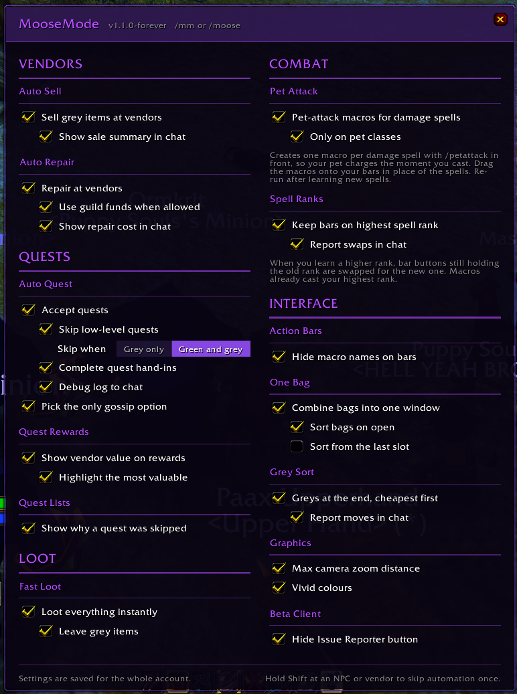
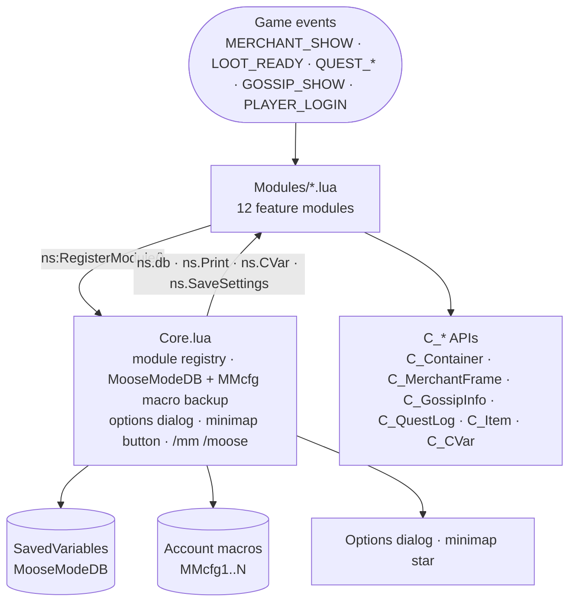

<div align="center">

# MooseMode

**Quality of life for World of Warcraft: Forever, from one settings window.**

[](./MooseMode/MooseMode.toc)
[](https://worldofwarcraft.blizzard.com)
[](./MooseMode/MooseMode.toc)
[](#license)

[](https://github.com/Moose-Ltd/MooseMode/actions/workflows/ci.yml)
<!-- Activates once the CurseForge listing is live. -->
[](https://www.curseforge.com/wow/addons/moosemode)

Sells greys, loots instantly, accepts and hands in quests, repairs, combines bags, and marks the best quest reward. Twelve small modules behind a purple star on the minimap, each one a tick you can turn off.



</div>

---

## Contents

[Highlights](#highlights) · [Modules](#modules) · [Architecture](#architecture) · [Quick start](#quick-start) · [Commands](#commands) · [Development](#development) · [Beta note](#beta-note) · [Repository map](#repository-map) · [Credits](#credits) · [Support](#support) · [License](#license)

For contributors: [`CONTRIBUTING.md`](./CONTRIBUTING.md) · [`CHANGELOG.md`](./CHANGELOG.md)

---

## Highlights

- 💰 **Vendors** - Greys are sold the moment a vendor opens, gear is repaired, and chat tells you what it cost or earned.
- 📜 **Quests** - Accept, hand in, and take the follow-up without clicking. Low-level quests are skipped, the best reward is framed in gold, and a note at the bottom of the window explains anything left for you.
- 🎁 **Loot** - Everything is taken the instant loot is ready. Optionally leave the greys.
- ⚔️ **Combat** - Pet-attack macros so a pet charges when a cast starts, and bar buttons that follow you to the highest spell rank.
- 🎒 **Interface** - One combined bag with a one-click sort, clean icons without macro names, wider camera zoom, and the beta Issue Reporter tucked away.
- ⚙️ **One dialog** - Grouped sections, sub-options, switches and tooltips. `/mm` or the minimap star opens it. Hold Shift at an NPC or vendor to skip automation once.
- 💾 **Beta-proof settings** - The beta client does not load saved variables yet, so settings are also backed up in an account macro and restored at login.

## Modules

| Module        | Group     | What it does                                                                                                | Default |
| ------------- | --------- | ----------------------------------------------------------------------------------------------------------- | ------- |
| Auto Sell     | Vendors   | Sells every grey item when a vendor opens, using the game's sell-all. Optional chat summary.                | on      |
| Auto Repair   | Vendors   | Repairs all gear at repair vendors. Sub-options: guild funds when allowed, cost in chat.                     | on      |
| Auto Quest    | Quests    | Accepts quests, hands in completed ones, picks up follow-ups, picks the only gossip option. Skips low-level quests (grey only, or green and grey). Debug log to chat. | on |
| Quest Rewards | Quests    | Vendor value on each reward choice; the most valuable one gets a gold frame and pulse, the rest are dimmed. | on      |
| Quest Lists   | Quests    | A line at the bottom of NPC quest windows names what Auto Quest left for you and why.                       | on      |
| Fast Loot     | Loot      | Takes every slot the instant loot is ready. Sub-option: leave grey items. Takes over the game's auto-loot setting while on. | on |
| Pet Attack    | Combat    | Creates one macro per damage spell with `/petattack` in front. Sub-option: only on pet classes.             | off     |
| Spell Ranks   | Combat    | Swaps bar buttons holding an old rank for the highest one you know. Sub-option: report swaps in chat.       | on      |
| One Bag       | Interface | Blizzard's combined bag window. Sub-option: sort on open. The sort always packs from the top.                         | on      |
| Action Bars   | Interface | Hides macro names under action bar icons.                                                                   | on      |
| Graphics      | Interface | Max camera zoom distance (on) and a vivid-colours contrast tick (off).                                       | mixed   |
| Beta Client   | Interface | Hides the beta Issue Reporter button.                                                                       | on      |

## Architecture



- **`Core.lua`** - Loads first. Owns the module registry, applies option defaults into `MooseModeDB`, and calls each module's `OnInit` once settings exist.
- **Settings** - Account-wide. Every write goes through the dialog controls and is mirrored into `MMcfg` account macros as a backup for the beta client.
- **Options dialog** - Built lazily from the registry: five groups balanced across two columns, section headers, checkboxes, `parent` sub-options that grey out with their parent, segmented `choice` switches, `button` rows and `note` rows.
- **Minimap button** - A custom purple icon on the minimap ring. Left-click toggles the dialog, drag moves it, `/mm icon` nudges the icon.
- **Slash commands** - `/mm`, `/moose` and `/moosemode` share one dispatcher; unknown words are routed to the module that registered them.
- **Module contract** - One file, one `ns:RegisterModule({ key, label, group, options, commands, OnInit })`. Modules read `ns.db.<optionKey>` at runtime and never at load.
- **API surface** - Forever is the Retail 12.x client, so only `C_*` namespaces are used. Every call is guarded for existence and for secret values.

## Quick start

1. Install:
   - **CurseForge app** - pick the Forever flavour and search for MooseMode, or
   - **Manual** - copy the `MooseMode` folder into `World of Warcraft\_classic_beta_\Interface\AddOns\`, or
   - **Development** - run `.\install.ps1` to link this repo's `MooseMode` folder into the game (`-Copy` to copy instead, `-Path` for another install).
2. Start the game and tick MooseMode on the AddOns screen.
3. Type `/mm` or `/moose`, or click the purple star on the minimap.

## Commands

| Command                   | What it does                                                        |
| ------------------------- | ------------------------------------------------------------------- |
| `/mm`, `/moose`           | Open or close the settings dialog                                   |
| `/mm minimap`             | Hide or show the minimap button                                     |
| `/mm icon <dx> <dy>`      | Nudge the minimap icon inside its ring (`/mm icon reset` to centre) |
| `/mm help`                | List every subcommand                                               |
| `/mm now`                 | Sell greys at the vendor that is open                               |
| `/mm repair`              | Repair at the vendor that is open                                   |
| `/mm cleanup`, `/mm sort` | Run the game's bag sort                                             |
| `/mm ranks`               | Swap bar buttons to the highest known spell rank now                |
| `/mm petmacros`           | Regenerate the pet-attack macros                                    |
| `/mm petmacro <spell>`    | Make or refresh one pet-attack macro                                |
| `/mm questdebug`          | Toggle the Auto Quest decision log in chat                          |
| `/mm rewarddebug`         | Toggle the Quest Rewards discovery log in chat                      |

## Development

```powershell
.\install.ps1                          # junction MooseMode/ into the beta AddOns folder; /reload in game after edits
.\package.ps1                          # build dist/MooseMode-<version>.zip for CurseForge
node tools/make_icon.js                # regenerate media/icon.tga and the PNG previews
node tools/make_icon.js --png out.png --size 512   # the icon at any size (avatars, listings)
```

Syntax check: the addon runs on Lua 5.1, so parse every file with [luaparse](https://github.com/fstirlitz/luaparse) in `luaVersion: "5.1"` mode. [`ci.yml`](./.github/workflows/ci.yml) is the reference script and runs on every push; it also fails a pull request that changes the addon without a changelog line.

### Releasing

Every change adds a line under `## Unreleased` in `CHANGELOG.md`. A release is: rename that heading to the version, bump `## Version` in the TOC, commit `Version X.Y.Z-forever`, tag `vX.Y.Z-forever`, push with tags. [`release.yml`](./.github/workflows/release.yml) builds the zip, publishes the GitHub Release and uploads to CurseForge with the changelog section as the file notes. Patch releases are welcome. Setup and the variables involved are in [CONTRIBUTING.md](./CONTRIBUTING.md).

### Adding a module

Create `Modules\YourThing.lua`, add it to the TOC after the module it belongs with, and register it:

```lua
local ADDON, ns = ...

ns:RegisterModule({
    key   = "yourThingModule",
    label = "Your Thing",
    group = "Interface",                     -- Vendors, Quests, Loot, Combat, Interface
    options = {
        { key = "yourThing", label = "Do the thing", default = true, tooltip = "Shown on hover." },
        { key = "yourThingLoud", label = "Report in chat", default = false, parent = "yourThing" },
        { type = "choice", key = "yourThingMode", label = "Mode", default = "a", parent = "yourThing",
          values = { { value = "a", text = "Quiet" }, { value = "b", text = "Loud" } } },
        { type = "button", label = "Run it now", buttonText = "Run", onClick = function() end },
        { type = "note", text = "One line of context under the section." },
    },
    OnInit   = function(mod) end,            -- ns.db exists here
    commands = { thing = function(rest) end }, -- /mm thing <rest>
})
```

Read settings with `ns.db.yourThing`. Helpers on `ns`: `Print`, `IsSecret`, `Coins`, `ItemIDFrom`, `ItemNameByID`, `CVar`, `SafeRegisterEvent`, `NumBags`, `SaveSettings`.

## Beta note

The Forever beta client writes addon saved variables on logout but does not read them back at launch, so every addon starts from defaults each session. MooseMode mirrors its non-default settings into account macros named `MMcfg1` and up, and restores from them at login while the client is like this. Leave those macros alone; they rewrite themselves. When Blizzard fixes loading, the real saved variables take over automatically.

## Repository map

```
MooseMode/
├── MooseMode/
│   ├── MooseMode.toc         # Interface 16001 + 120105, load order, SavedVariables, licence and website
│   ├── Core.lua              # Registry, settings + macro backup, options dialog, minimap button, slash commands
│   ├── media/icon.tga        # Minimap icon (generated by tools/make_icon.js)
│   └── Modules/
│       ├── AutoSell.lua      # Vendors: sell greys via the game's sell-all
│       ├── AutoRepair.lua    # Vendors: repair all, guild funds optional
│       ├── AutoQuest.lua     # Quests: accept, hand in, follow-ups, gossip, low-level rule, debug log
│       ├── QuestRewards.lua  # Quests: vendor value + gold highlight on reward choices
│       ├── QuestLists.lua    # Quests: "skipped" note at the bottom of NPC quest windows
│       ├── FastLoot.lua      # Loot: instant looting, optional leave-greys, owns the auto-loot CVar
│       ├── PetAttack.lua     # Combat: /petattack macros per damage spell
│       ├── SpellRanks.lua    # Combat: bar buttons follow the highest known rank
│       ├── OneBag.lua        # Interface: combined bag window + sort options
│       ├── ActionBars.lua    # Interface: hide macro names on bars
│       ├── Graphics.lua      # Interface: max camera zoom, vivid colours
│       └── BetaTweaks.lua    # Interface: hide the beta Issue Reporter
├── tools/
│   ├── make_icon.js          # Icon generator (TGA + PNG, any size)
│   └── *.png                 # Icon previews and avatar exports
├── .github/
│   ├── workflows/ci.yml      # Lua 5.1 parse + TOC checks on every push and PR
│   ├── workflows/release.yml # Builds and attaches the zip when a v* tag is pushed
│   └── ISSUE_TEMPLATE/       # Bug report and feature request forms
├── install.ps1               # Link or copy the addon into a WoW install
├── package.ps1               # Build the release zip locally
├── CHANGELOG.md              # Release notes
├── CONTRIBUTING.md           # Setup, conventions, bug reports, shipping
├── LICENSE                   # Proprietary terms
└── README.md                 # You are here
```

## Credits

- API baseline for the Forever beta captured by [forever-addon-kit](https://github.com/Thunderz96/forever-addon-kit).

World of Warcraft and Blizzard Entertainment are trademarks of Blizzard Entertainment, Inc. MooseMode is an independent fan project and is not affiliated with or endorsed by Blizzard Entertainment.

## Support

If MooseMode saves you a few thousand clicks, the kettle bill thanks you.

[](https://ko-fi.com/mooseza)

## License

Copyright © 2026 Matt Berry / Moose Ltd. All rights reserved. See [LICENSE](./LICENSE).
